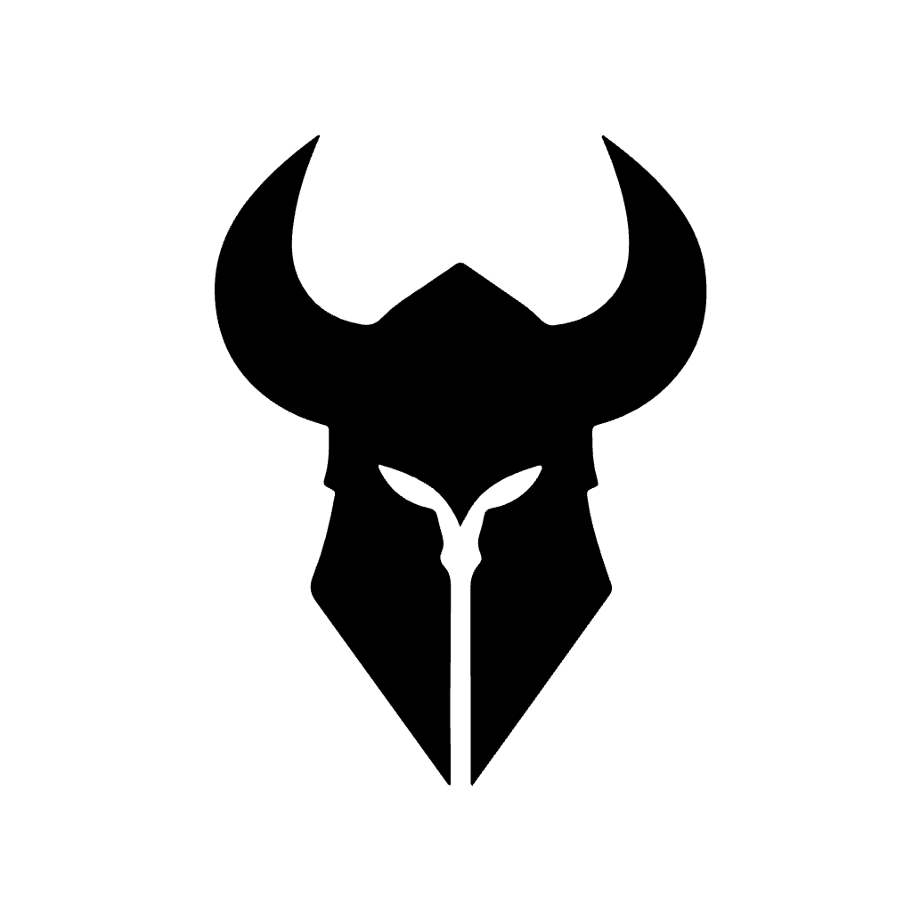
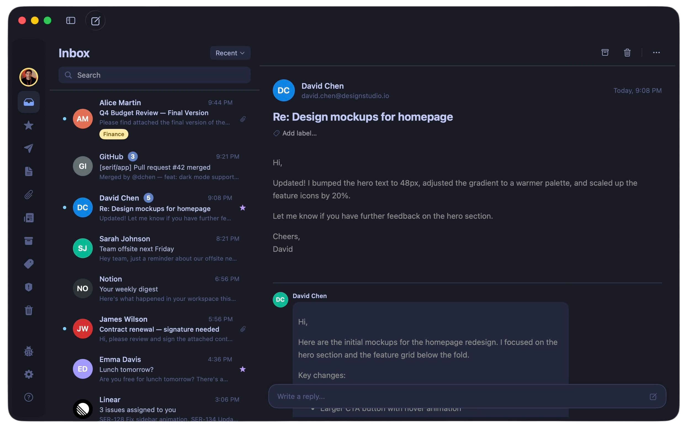

<p align="center">
  
</p>

<h1 align="center">Serif</h1>

<p align="center">
  <em>The email client Gmail deserves on macOS.</em>
</p>

<p align="center">
  
  
  
  
  
</p>

<p align="center">
  
</p>

---

A native macOS Gmail client. No Electron. No web wrapper. Just Swift, SwiftUI, and speed.

**Cache-first.** Your inbox loads before you blink.

**Privacy-first.** Tracking pixels blocked. No telemetry. Ever.

**Native-first.** Feels like it shipped with your Mac.

## ✨ Features

| | |
|---|---|
| 💬 **Chat-style threads** | Conversations with bubbles, quote collapsing, and thread grouping |
| 🔒 **Tracker blocking** | Spy pixels, tracking links, and CSS trackers — all stripped automatically |
| 🔍 **Smart search** | Gmail query syntax + semantic attachment search across your entire mailbox |
| 📅 **Calendar invites** | Event cards with one-click RSVP — accept, decline, maybe |
| ✉️ **One-click unsubscribe** | RFC 8058 compliant. See all your subscriptions in one view |
| 🤖 **AI-powered** | On-device email summaries and quick reply suggestions (Apple Intelligence, macOS 26+) |
| 🏷️ **Label management** | Create, rename, delete, and sync Gmail labels |
| 📎 **Attachment search** | Browse, search, and preview all attachments with thumbnail caching |
| 🖨️ **Print** | Clean HTML-based email printing |
| ✍️ **Signatures** | Per-account signature management synced with Gmail |
| 🎨 **15 themes** | 10 dark + 5 light, with per-color overrides |
| ⌨️ **Keyboard-first** | `⌘F` search · `⌘↩` send · `⌘Z` undo send |
| 👥 **Multi-account** | Switch accounts seamlessly, each with its own settings |
| 🔄 **Auto-update** | Built-in Sparkle updates with appcast |
| 👤 **Contact avatars** | Google Contacts, Gravatar, and BIMI brand logos |


## Getting Started

```bash
git clone https://github.com/marshallino16/Serif.git
```

1. Open `Serif.xcodeproj` in Xcode 15+
2. Add your Google OAuth credentials in `Serif/Configuration/GoogleCredentials.swift`
3. Build and run (macOS 14+)

> Requires a Google Cloud project with Gmail API enabled and an OAuth 2.0 Desktop client.

## License

Private project. All rights reserved.
